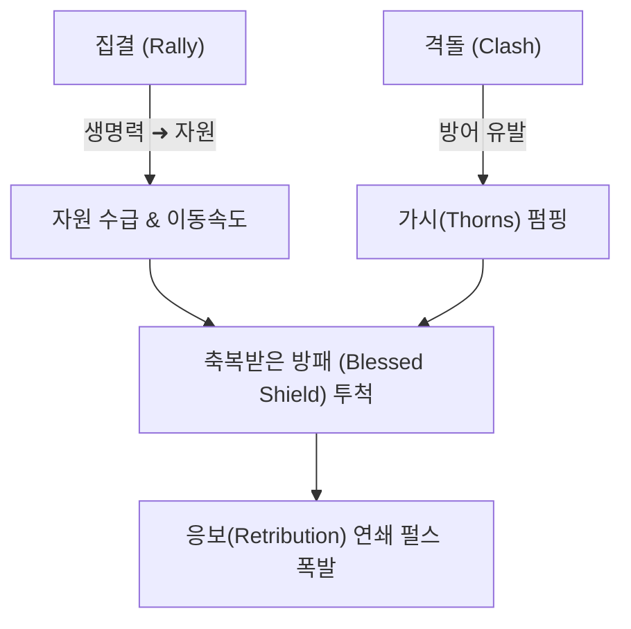

# 응보의 방패 성기사 레벨링 가이드 (Shield of Retribution Paladin Leveling)

## 1. 빌드 개요 (Overview)
이 빌드는 물리 가시(Thorns) 피해와 거한(Juggernaut) 시너지를 기반으로 하는 레벨링 세팅입니다. 주 공격기인 축복받은 방패(Blessed Shield)에 응보 업그레이드를 적용하여 펄스를 발산하는 파괴의 원반을 적 무리에 던져, 보스전에서도 뛰어난 밸런스를 보여줍니다. 

### 장단점 (Pros & Cons)
* **장점**: 엄청나게 빠른 레벨링(Super Fast), 무기 데미지에 구애받지 않음, 엔드게임 전환 용이.
* **단점**: 광역 범위가 다소 좁음(Small AoE), 쿨타임 사이클 타이밍 관리가 필요함.

---

## 2. 사냥법 및 기술 활용 (Gameplay & Rotation)
1. **버프 및 자원 확보**: 격돌(Clash)과 방어 기제를 사용하여 가시 피해량을 펌핑하고, 집결(Rally)을 사용하여 생명력을 자원으로 전환합니다. 직업 고유 치유 스킬들을 활용하여 체력과 신앙(Faith)을 수급하세요.
2. **원반 투척 딜링**: 메인 스킬인 축복받은 방패(Blessed Shield)를 적 무리에 투척합니다. 적과 적 사이를 튕기며 응보 펄스를 발산하여 모든 것을 녹여버립니다!

---

## 3. 장비 및 스탯 조건 (Requirements)

| 분류 | Starter (1-50렙 구간) | Early Endgame (50-70렙) |
|---|---|---|
| **핵심 고유 장비** | (없음 - 아무 레어/전설 장비 착용) | 자카룸의 전령 또는 고유 방패 획득 시 착용 |
| **필수 위상** | 어스름(Umbral), 바늘불꽃(Needleflare) | 응보(Retribution), 거한(Juggernaut) |
| **방어 스탯** | 최대 생명력 | 방어도 9,230 캡 달성, 원소 저항 70% 캡 달성 |
| **공격 스탯** | 가시(Thorns) 피해 | 극대화 확률 등 기초 스탯 |

### 💡 획득처 및 파밍 팁 (Acquisition & Tips)
*   **레벨링 무기**: 무기의 초당 공격력(DPS)에 영향을 받지 않으므로, 데미지가 낮아도 가시, 생명력 등의 유효 옵션이 붙은 무기를 착용하세요.
*   **자카룸의 전령**: 50레벨 이후 고행 난이도 진입 시 **아스타로트 (Astaroth)**에서 고정 파밍하여 엔드게임 빌드로 전환하세요.
*   **필수 위상**: 던전 클리어를 통해 힘의 전서(Codex of Power)에 선등록 해두면 무기 교체 시마다 각인이 편리합니다.

---

## 4. 로드맵 (Progression Roadmap)
레벨링 특화 빌드이므로 1~70렙 구간에 집중됩니다.

| 진행 단계 | 레벨 기준 | 핵심 목표 |
|---|---|---|
| **Starter** | 레벨 1 - 50 | 던전을 돌며 힘의 전서 위상 확보, 메인/서브 퀘스트 밀기 |
| **Early** | 레벨 50 - 70 | 고행 진입 준비, 신성/선조 아이템 파밍, 방어도 캡 달성 |
