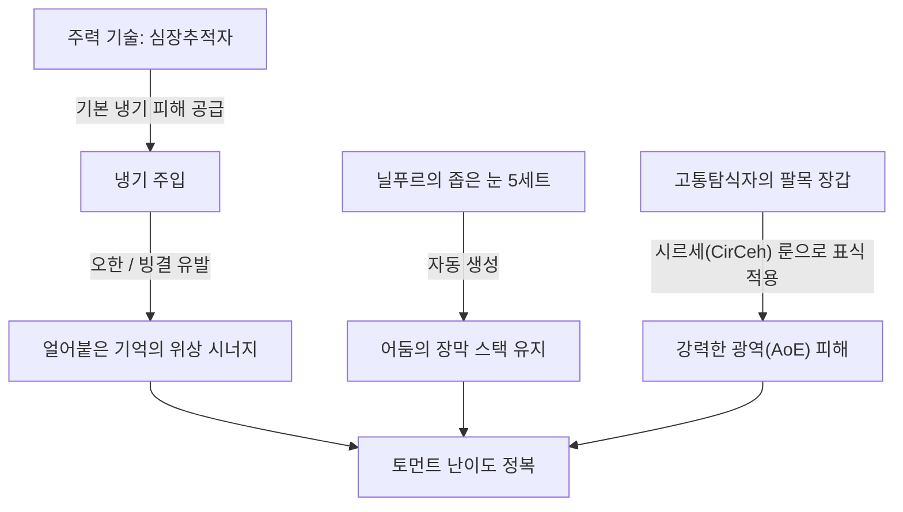

# 디아블로 IV 시즌 14: 죽음의 각성 - 심장추적자 도적 엔드게임 빌드 가이드
> [!NOTE]
> 본 가이드는 Maxroll.gg의 시즌 14 최신 **심장추적자 도적(Heartseeker Rogue)** 빌드를 분석하여 작성되었습니다. 모든 게임 용어는 한국어 공식 명칭을 따르며, 아이템 등급 및 기술 종류에 맞추어 정밀 분류되었습니다.

---

## 1. 빌드 개요 및 핵심 메커니즘
**심장추적자 도적**은 활 또는 쇠뇌를 사용하는 원거리 명사수 빌드로, 뛰어난 유틸리티와 시원한 속도감, 단일 및 광역 딜러로서의 밸런스가 매우 잘 잡힌 인기 빌드입니다. 

시즌 14 '죽음의 각성'에서는 **베라티엘의 파편** 없이도 Starter 빌드를 굴릴 수 있도록 장벽이 낮아졌으며, 신규 참(Charm) 시스템인 **닐푸르의 좁은 눈** 5세트 장신구를 완성하면서 빌드의 파워와 편의성이 한층 더 강화되었습니다.

---

## 2. 사냥법 및 스킬 활용 메커니즘 (Gameplay)

전투 시 시너지 극대화와 버프 유지를 위한 스킬 로테이션 및 조건 순서는 다음과 같습니다.

### 2.1. 핵심 스킬 활용법
*   **심장추적자** [스킬/고유] (스팸): 주력 딜링 기술입니다. 투사체가 벽에 막히면 기력 회복과 딜이 손실되므로, 개활지에서 사격하는 것이 중요합니다.
*   **냉기 주입** [스킬/고유] (상시 활성화): 재사용 대기시간이 돌 때마다 눌러 상시 유지합니다. 빙결 및 오한 제어 효과를 발생시켜 공격 배율을 증폭시킵니다.
*   **은신** [스킬/고유] (은신 및 확정 극대화): 치명타 확률 보정과 **광기** 중첩 수급을 위해 사용합니다.
*   **질주** [스킬/고유] (포지셔닝 및 광기 충첩): 전투 초반에 **광기(Ferocity)** 중첩을 빠르게 쌓기 위해 질주를 적극적으로 사용합니다.
*   **어둠의 장막** [스킬/고유] (생존 버프): Starter 단계에서는 직접 시전하지만, **닐푸르의 좁은 눈** 5세트 완성 이후에는 자동 갱신되므로 스킬바에서 제외하고 **그림자 걸음**이나 **연막탄**을 대신 등록합니다.

### 2.2. 전투 로테이션 및 시너지 흐름
1.  **진입 및 광기 램프업**: **질주** 또는 **그림자 걸음**으로 진입하며 **광기(Ferocity)** 버프 스택을 활성화합니다.
2.  **군중 제어(CC) 및 기력 수급**: **집결의 반전 위상** 효과로 적을 오한/빙결 시키거나 비틀거리게 만들면 기력과 광기 중첩이 수급됩니다. 초반에 CC가 모자랄 때는 늑대를 소환하는 **체(Ceh)** 룬을 사용해 강제로 오한을 묻힙니다.
3.  **광역 디버프 (마킹)**: **고통탐식자의 팔목 장갑**을 채용한 상태에서 **시르세(CirCeh)** 룬워드 등을 활용해 광범위하게 표식을 남깁니다.
4.  **심장추적자 스팸**: 표식이 묻은 대상에게 **냉기 주입**이 적용된 **심장추적자**를 연사하여 일망타진합니다.

---

## 3. 단계별 장비 요구 조건 (Starter ➜ Midgame ➜ Endgame)

| 구분 | 단계 | 핵심 장비 및 스펙 조건 | 메커니즘 및 셋업 변화 |
| :--- | :--- | :--- | :--- |
| **최소 조건** | **Starter** | <ul><li>물리 **심장추적자** 베이스</li><li>**포악한 위상** [위상], **집결의 반전 위상** [위상], **저주받은 손길의 위상** [위상]</li><li>스킬창에 **어둠의 장막** 직접 등록</li><li>**체(Ceh)** 룬 [룬] (오한 트리거용)</li></ul> | <ul><li>**에트나의 잃어버린 단검**이나 **베라티엘의 파편** 없이 시작하여 진입 장벽이 매우 낮음</li><li>안정적인 **광기** 램프업을 위해 **질주**를 적극 활용</li></ul> |
| **최적 조건** | **Midgame** | <ul><li>**고통탐식자의 팔목 장갑** [고유] + **불한당의 입맞춤** [신화]</li><li>**닐푸르의 좁은 눈** [세트] 5세트 장신구 세트</li><li>**에트나의 잃어버린 단검** [고유] + **얼어붙은 기억의 위상** [위상]</li><li>**베라티엘의 파편** [고유] (자원 담금질 필수)</li><li>재사용 대기시간 감소(CDR) **25%** 이상</li><li>장신구/참에서 주입 기술 등급 **+3** 이상</li><li>고유 참 **푸른서슬** 채용</li></ul> | <ul><li>**닐푸르의 좁은 눈** 5세트 완성으로 **어둠의 장막**을 스킬 바에서 제거</li><li>**냉기 주입** 상시 무한 유지 가능</li><li>**고통탐식자**를 통해 본격적인 광역 딜러로 진화</li><li>**베라티엘의 파편**의 에너지 소모를 반지 담금질로 해결</li></ul> |
| **완벽 조건** | **Endgame** | <ul><li>모든 고유 장비 신화 등급 업그레이드</li><li>신화 투구 **할리퀸 관모** [신화] (샤코) 장착</li><li>극대화 확률 **75%** 달성 (버프 포함)</li><li>고유 참 **검투사의 승리** 채용</li><li>우두머리용 스왑 무기 (**고속의 위상** [위상] 세팅)</li></ul> | <ul><li>**할리퀸 관모** 획득으로 참에서 주입 등급을 빼고 명사수 기술 등급을 챙겨 딜 극대화</li><li>**검투사의 승리**와 **고통탐식자**의 마킹이 더블 딥핑(이중 곱연산) 되어 한계를 뚫는 극딜 세팅 완성</li></ul> |

---

## 4. 최적 파밍 루트 및 성장 전략

### 4.1. [1단계] 스타터 진입 및 기본 위상 파밍
*   기본 전설 위상들을 힘의 전서(Codex)에 등록합니다. (**포악한 위상**, **집결의 반전 위상**, **저주받은 손길의 위상**).
*   이때는 신화나 전용 고유가 없으므로 물리 베이스로 가동하며 난이도 **고뇌 1(Torment 1)**에 안정적으로 정착하는 것을 최우선 목표로 합니다.

### 4.2. [2단계] 핵심 고유 수급 (고통탐식자 & 불한당의 입맞춤)
*   **고통탐식자의 팔목 장갑**: 빌드 광역 딜의 핵심입니다. 이를 드랍하는 **바르샨** 또는 **얼음 속의 야수(Beast in the Ice)** 우두머리를 타겟팅하여 집중 파밍합니다.
*   **닐푸르의 좁은 눈**: 시즌 14 핵심 시스템입니다. **혼돈계 틈새**와 **죽음의 무게 석실**을 적극적으로 클리어하여 5세트 장신구를 완벽히 갖춥니다.
*   **베라티엘의 파편**: **바르샨** 파밍을 통해 획득을 노립니다. 단, 베라티엘 착용 전 반지에 반드시 **자원 회복 담금질** 옵션을 챙겨 기력 부족 현상을 예방하세요.

### 4.3. [3단계] 고뇌 난이도 정복 및 신화 아이템 제작
*   고뇌 티어가 올라가면 치명타 확률을 끌어올리면서 **푸른서슬** 참을 활용해 빌드를 안정시킵니다.
*   **신화 등급 제작 (호라드림의 함)**: 우버 보스(안다리엘, 듀리엘 등)를 처치하고 시즌 여정을 마쳐 **판데모니움 파편**을 수집합니다.
*   **신화 크래프팅 및 파밍 추천 우선순위**:
    1.  **불한당의 입맞춤 (Scoundrel's Kiss)**
    2.  **베라티엘의 파편 (Shard of Verathiel)**
    3.  **고통탐식자의 팔목 장갑 (Paingorger's Gauntlets)**
    4.  **할리퀸 관모 (Harlequin Crest)** - 획득 시 쿨감과 스킬 등급 혜택으로 빌드가 완성 단계에 진입
    5.  **에트나의 잃어버린 단검 (Etna's Lost Dagger)**
    6.  **펠게인의 인장 반지 (Signet of Pelghain)**

### 4.4. [4단계] 극엔드게임 스펙업 (검투사의 승리 & 보스 스왑)
*   치명타 확률이 75%를 넘기면 **검투사의 승리** 참을 장착하여 딜을 비약적으로 더블 딥핑시킵니다.
*   상위 던전인 **나락(Push)** 및 **탑(Tower)** 푸시를 위해 **칼춤**을 활용한 **Spin 2 Win** 변종 세팅(쇠뇌 활용)으로 전환하며 완성합니다.

### 4.5. 파밍 콘텐츠 타임라인 로드맵 (Gantt Chart)
아래 타임라인 차트는 레벨 및 난이도 성장에 따른 최적의 파밍 시기와 콘텐츠의 유기적 연계를 보여줍니다.

```mermaid
gantt
    title 심장추적자 도적 시즌 14 파밍 로드맵 타임라인
    dateFormat  X
    axisFormat %d
    section 레벨링 & 기초 셋업
    1-50lv 스타터 위상 파밍 (고뇌1 입성) :active, level1, 0, 50
    지옥물결 & 기본 전설 힘의 전서 수집 : level1_sub, 0, 60
    section 핵심 시스템 확보
    혼돈계 틈새 & 닐푸르의 좁은 눈 (5세트) : level2, 50, 80
    바르샨/얼음야수 타겟팅 (고통탐식자 & 베라티엘) : level2_sub, 60, 90
    section 엔드게임 최적화
    판데모니움 파편 수집 & 신화 장비 크래프팅 : level3, 80, 100
    안다리엘/듀리엘 (샤코 & 불한당의 입맞춤 완비) : level3_sub, 80, 100
    section 극엔드게임 푸시
    치명타 75%+ & 검투사의 승리 세팅 : level4, 95, 120
    나락/탑 고단 푸시 및 보싱 무기 스왑 : level4_sub, 100, 120
```

