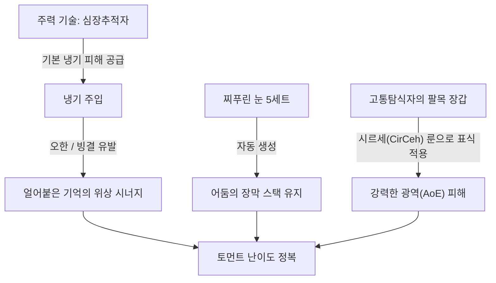

# 심장추적자 도적 시즌 14 엔드게임 빌드 가이드
본 가이드는 Maxroll.gg의 시즌 14 심장추적자(Heartseeker) 도적 엔드게임 빌드를 한글 공식 번역 사전에 맞추어 분석 및 요약한 자료입니다.

## 1. 빌드 메커니즘 개요 (Overview)
*   **핵심 작동 원리**: 빠른 공격 속도를 활용해 **심장추적자**를 연사하여 자원을 수급하고 냉기 주입과 연계하여 오한/빙결 시너지를 증폭시킵니다.
*   **시즌 14 변경 사항**: 시즌 14 '죽음의 각성'에서는 **베라티엘의 파편** 없이도 Starter 빌드를 굴릴 수 있도록 장벽이 낮아졌으며, 신규 참(Charm) 시스템인 **찌푸린 눈** 5세트 장신구를 완성하면서 빌드의 파워와 편의성이 한층 더 강화되었습니다.

---

## 2. 사냥법 및 스킬 활용 메커니즘 (Gameplay)
전투 시 시너지 극대화와 버프 유지를 위한 스킬 로테이션 및 조건 순서는 다음과 같습니다.

### 2.1. 핵심 스킬 활용법
*   **심장추적자** [스킬/고유] (스팸): 주력 딜링 기술입니다. 투사체가 벽에 막히면 기력 회복과 딜이 손실되므로, 개활지에서 사격하는 것이 중요합니다.
*   **냉기 주입** [스킬/고유] (상시 활성화): 재사용 대기시간이 돌 때마다 눌러 상시 유지합니다. 빙결 및 오한 제어 효과를 발생시켜 공격 배율을 증폭시킵니다.
*   **은신** [스킬/고유] (은신 및 확정 극대화): 치명타 확률 보정과 **광기** 중첩 수급을 위해 사용합니다.

---

## 3. 단계별 장비 요구 조건 (Build Stage Requirements)

| 빌드 단계 | 권장 최소 사양 및 핵심 아이템 | 조건 및 매뉴얼 |
| :--- | :--- | :--- |
| **최소 조건 (Starter)** | 캐릭터 레벨 1~60 및 일반 힘의 전서 위상 각인 | **어둠의 장막** 수동 직접 시전, 집결의 반전 위상 장착 |
| **최적 조건 (Midgame)** | 정복자 레벨 1~100 돌파, 고뇌 1~2 진입 | 찌푸린 눈 5세트, 고통탐식자의 팔목 장갑 |
| **완벽 조건 (Endgame)** | 정복자 레벨 200~300, 고뇌 4 진입 및 나락 고단 | 할리퀸 관모(샤코) 제작, 치명타 확률 75%+ 달성, 검투사의 승리 |

---

## 4. 최적 파밍 루트 및 성장 전략 (Farming Roadmap)
시즌 6+ 공식 정복자 및 고뇌 단계를 반영한 시간선 파밍 순서입니다.

### 4.1. [1단계] 스타터 셋업 (Lv 1 - 60)
*   캠페인 클리어 및 기본 속성 던전을 돌아 핵심 위상(집결의 반전 위상 등)을 힘의 전서에 해제합니다.
*   레벨 60 전까지는 마나 부담이 없는 일반 물리 심추 기반 빌드를 구동합니다.

### 4.2. [2단계] 토먼트 1~2 안착 (Paragon 1 - 100)
*   지옥물결 및 혼돈계 틈새를 돌며 장비 옵션을 전설 등급으로 교체합니다.
*   바르샨 소환용 재료를 파밍하여 핵심 고유인 고통탐식자의 팔목 장갑과 베라티엘의 파편을 타겟팅 파밍합니다.
*   찌푸린 눈 장신구 5세트를 수급하여 어둠의 장막 자동 갱신 체계를 가동합니다.

### 4.3. [3단계] 토먼트 3~4 최적화 (Paragon 100 - 200)
*   우두머리를 수시 소환해 판데모니움 파편을 파밍하고, 호라드림의 함을 통해 불한당의 입맞춤과 할리퀸 관모 신화 고유를 제작합니다.
*   재사용 대기시간 감소(CDR)를 25% 이상 맞춰 냉기 주입 가동률을 상시 수준으로 램프업합니다.

### 4.4. [4단계] 극엔드게임 스펙업 (Paragon 200 - 300)
*   치명타 확률이 75%를 넘기면 검투사의 승리 참을 장착하여 피해 배율을 더블 딥핑시킵니다.
*   나락(Push) 고단 푸시와 탑(Tower) 랭킹을 위해 칼춤 스핀 변형 셋업을 완비합니다.

### 4.5. 파밍 콘텐츠 타임라인 로드맵 (Gantt Chart)

```mermaid
gantt
    title 심장추적자 도적 시즌 14 파밍 로드맵 타임라인 (시즌 6+ 스케일)
    dateFormat  X
    axisFormat %d
    section 스타터 (Lv 1-60)
    1-60lv 기초 위상 파밍 (고뇌1 입성) :active, level1, 0, 60
    지옥물결 & 힘의 전서 수집 : level1_sub, 0, 60
    section 얼리 (Paragon 1-100)
    바르샨/얼음야수 타겟팅 (고통탐식자 & 베라티엘) : level2, 60, 100
    찌푸린 눈 5세트 장신구 수급 : level2_sub, 60, 100
    section 미드 (Paragon 100-200)
    판데모니움 파편 파밍 & 신화 장비 크래프팅 : level3, 100, 200
    재대감 25% 및 냉기 주입 상시화 : level3_sub, 120, 200
    section Late/Push (Paragon 200-300)
    치명타 75%+ & 검투사의 승리 세팅 : level4, 200, 300
    나락/탑 고단 푸시 및 칼춤 스핀 스왑 : level4_sub, 240, 300
```

