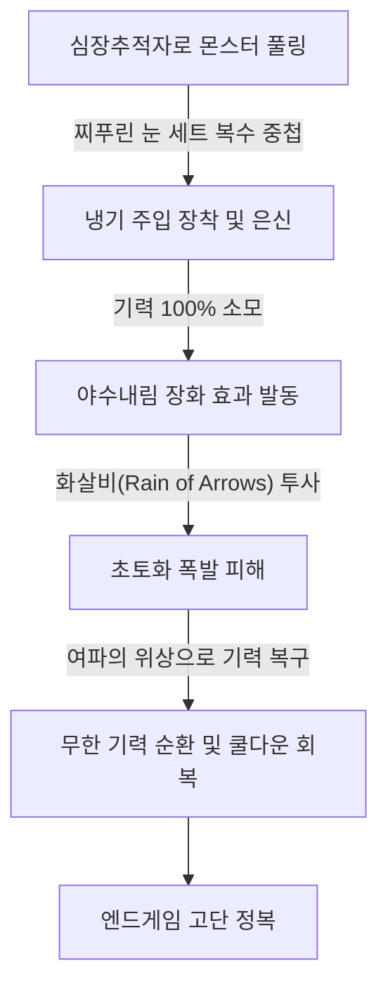

# 화살비 도적 시즌 14 엔드게임 빌드 가이드
본 가이드는 Maxroll.gg의 시즌 14 화살비(Rain of Arrows) 도적 엔드게임 빌드를 로컬 공식 번역 사전에 맞추어 분석 및 요약한 자료입니다.

## 1. 빌드 메커니즘 개요 (Overview)
*   **핵심 작동 원리**: 화살비는 시각적 파괴력과 강력한 광역(AoE) 딜링 및 군중 제어 능력을 결합한 냉기/독 베이스의 고화력 빌드입니다. 몬스터들을 모으는 풀링(Pulling) 능력과 단일 타겟 폭딜을 동시에 챙긴 하이브리드 궁극기 빌드입니다.
*   **빌드 가동 브레이크포인트 (Breakpoints)**:
    1.  **최대 에너지 225 달성 (Paragon Push는 300)**: 야수내림 장화 효과를 극대화하기 위해 머리, 가슴, 장화, 목걸이, 참 세트에서 최대 자원 옵션을 반드시 확보해야 합니다.
    2.  **화살비 재사용 대기시간 15초 (재대감 63% 목표)**: 투구, 장갑, 반지, 목걸이에서 극대화된 재대감(CDR) 옵션 및 템퍼링을 맞춰 딜 로스를 없애야 합니다.
*   **중요 기어 시너지**:
    *   야수내림 장화 [고유] (필수): 기력을 100% 소모해 화살비 피해를 극적으로 증폭시키는 핵심 부품으로, 이 장화가 없으면 빌드 작동이 불가능합니다.
    *   여파의 위상 [위상] (필수): 궁극기 시전 시 소모한 기력을 즉시 대량으로 복구하여 연속 스팸을 가능하게 해 줍니다.
    *   찌푸린 눈 [부적/참] (필수): 복수(Vengeance) 중첩을 유지하고 푸른서슬 분신 버그를 피하기 위해 장착합니다.

---

## 2. 사냥법 및 스킬 활용 메커니즘 (Gameplay)
화살비의 쿨다운을 최대한 낮추고, 기력 소모와 수급을 무한 루프로 굴리는 스킬 연계 순서입니다.

### 2.1. 핵심 스킬 활용법
*   **화살비** [스킬] (주력 딜): 에너지가 가득 찼을 때 시전하여 야수내림 장화의 피해 증폭 효과를 묻힙니다.
*   **심장추적자** [스킬] (풀링 & 복수 버프): 몬스터들을 모으고 찌푸린 눈 참의 복수(Vengeance) 스택을 유지하기 위해 쿨다운마다 수동 시전합니다.
*   **냉기 주입** [스킬] (상시 활성화): 쿨마다 지속 사용하여 영구적인 냉기 CC와 취약 상태를 공급합니다.
*   **은신** [스킬] (확정 치명타): 치명타 확률을 보정하고 광기(Ferocity) 중첩 수급을 위해 활용합니다.

---

## 3. 단계별 장비 요구 조건 (Build Stage Requirements)
화살비 도적은 **장비 의존도가 극도로 높은 빌드**로, 스타터 셋업이 존재하지 않습니다. 타 빌드로 파밍 후 전환하는 것을 엄격히 권장합니다.

| 빌드 단계 | 권장 최소 사양 및 핵심 아이템 | 조건 및 매뉴얼 |
| :--- | :--- | :--- |
| **최소 조건 (Starter)** | *가용 불가 (No Starter Setup)* | 타 빌드로 레벨 70 달성 및 고뇌 1 파밍 후 가동 권장 |
| **최적 조건 (Midgame)** | 최대 기력 225 돌파, 화살비 쿨다운 15초 (CDR 63%) | 야수내림 장화, 불한당의 입맞춤, 여파의 위상, 찌푸린 눈 5세트 |
| **완벽 조건 (Endgame)** | 최대 기력 300 돌파, 화살비 쿨다운 20초 (더블 데미지 노드) | 할리퀸 관모, 펠게인의 인장 반지, 얼어붙은 기억의 위상 1손 가마 스왑 |

---

## 4. 최적 파밍 루트 및 성장 전략 (Farming Roadmap)
시즌 6+ 공식 정복자 레벨 및 고뇌 난이도를 반영한 화살비 전용 파밍 시간선입니다.

### 4.1. [1단계] 타 빌드 레벨링 (Lv 1 - 60)
*   화살비는 기어 장벽이 높으므로, 일반 심추 도적으로 레벨 60까지 달성합니다.
*   힘의 전서에서 자원 회복 및 기초 방어 위상을 먼저 해제합니다.

### 4.2. [2단계] 코어 유니크 파밍 (Paragon 1 - 100)
*   **고뇌 1** 입성 후 혼돈계 틈새에서 찌푸린 눈 부적 5세트를 획득합니다.
*   빙결 야수를 처치해 핵심 신발인 야수내림 장화를 최우선 타겟팅 파밍합니다.
*   기력 225 브레이크포인트와 CDR 63% 세팅을 완료하는 즉시 화살비 빌드로 전환합니다.

### 4.3. [3단계] 스펙 최적화 및 보스전 스왑 (Paragon 100 - 200)
*   정복자 보드에서 곡예가 및 책략 보드를 결합하고 희귀 문양인 통제와 매복을 강화합니다.
*   보스전 성능(Unstoppable 대상) 보완을 위해 **고속의 위상**이 각인된 보조 무기로 보스 방 진입 전 스왑하여 킬타임을 비약적으로 줄입니다.

### 4.4. [4단계] 극엔드게임 나락 푸시 (Paragon 200 - 300)
*   호라드림의 함에 판데모니움 파편을 넣어 할리퀸 관모를 크래프팅합니다.
*   푸시 전용 링인 펠게인의 인장 반지를 장착하여 최대 에너지 300 세팅과 화살비 더블 발사 특성을 완비하여 나락 고단을 파괴합니다.

### 4.5. 파밍 콘텐츠 타임라인 로드맵 (Gantt Chart)

```mermaid
gantt
    title 화살비 도적 시즌 14 파밍 로드맵 타임라인 (시즌 6+ 스케일)
    dateFormat  X
    axisFormat %d
    section 스타터 (Lv 1-60)
    타 빌드(심추 등) 기반 레벨링 및 고뇌1 진입 :active, level1, 0, 60
    기초 생존/기력 위상 전서 수집 : level1_sub, 0, 60
    section 얼리 (Paragon 1-100)
    빙결 야수 처치 (야수내림 장화 타겟팅) : level2, 60, 100
    찌푸린 눈 5세트 장신구 세팅 완료 : level2_sub, 70, 100
    section 미드 (Paragon 100-200)
    CDR 63% 및 최대 기력 225 브레이크포인트 매칭 : level3, 100, 200
    보스전 대비 고속의 위상 무기 스왑 세팅 : level3_sub, 120, 200
    section Late/Push (Paragon 200-300)
    신화 샤코 크래프팅 및 펠게인의 인장 반지 세팅 : level4, 200, 300
    나락 고단 푸시 및 20초 더블데미지 특성 변환 : level4_sub, 220, 300
```

