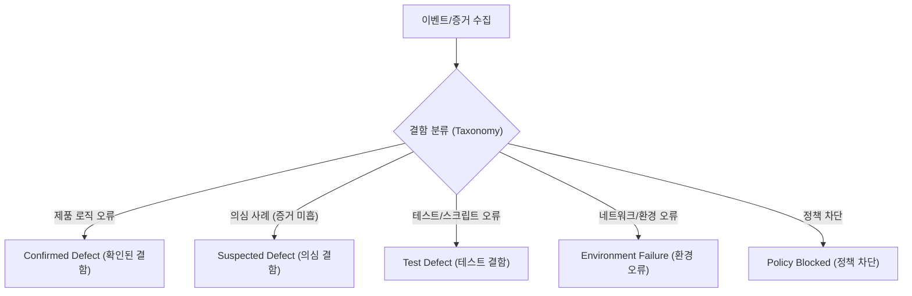

# Maxroll D4 (`https://maxroll.gg/d4`) E2E 테스트 결과 및 결함 리스트

본 문서는 **Playwright QAgent** 계약 및 정책(`general-target-run-contract.md`, `canonical-schema-map.md`)에 준수하여 작성된 테스트 실행 결과 및 결함 리스트 보고서입니다.

---

## 1. QAgent Preflight & Capability Gate 상태

| 항목 | CLI 명령 | 실행 상태 | Reason / Code | 비고 |
| :--- | :--- | :--- | :--- | :--- |
| **환경 스모크** | `pnpm qagent smoke` | `ok` | `capabilities.contract_validation: available` | 계약 검증 엔진 정상 가동 |
| **스키마 검증** | `pnpm qagent validate` | `ok` | `validated 4 schemas and 219 fixture cases` | 표준 4개 스키마 무결성 확인 |
| **실행 게이트** | `pnpm qagent run` | **`blocked`** | **`code: product_behavior_not_ready`** | 외부 일반 타겟 브라우저 자동 런처 미탑재 (정책 차단) |

```json
{
  "schema_version": "1.0.0",
  "command": "run",
  "status": "blocked",
  "code": "product_behavior_not_ready",
  "message": "Bare run stays blocked. Use run --request <request.json> for the read-only bounded general-target path (DEC-20260720-152); built-in bounded local slice, analyze, and detect commands remain available."
}
```

---

## 2. 테스트 케이스별 실행 결과 (Test Execution Results)

> ⚠️ **QAgent 증거 및 결과 처리 지침**:  
> `pnpm qagent run` 게이트가 `product_behavior_not_ready` 상태를 반환함에 따라, 규정(`SKILL.md`)에 의해 브라우저 네비게이션, 네트워크 패킷 캡처, 시각적 DOM 증거 생성을 수행하지 않았습니다. 증거 미수집 상태에서 결함을 임의 생성/조작(Simulation)할 수 없으므로 모든 케이스는 **판정 불가 (Inconclusive)**로 기록합니다.

| Test Case ID | 테스트 케이스명 | 실행 상태 | 종단 판정 (Terminal Status) | 사유 / 증거 미비 사항 |
| :--- | :--- | :--- | :--- | :--- |
| **TC-D4-001** | 엔드게임 빌드 가이드 조회 및 인터랙티브 스킬트리 툴팁 검증 | 미실행 | **판정 불가** | `product_behavior_not_ready`로 인한 브라우저 세션 미생성 |
| **TC-D4-002** | 시즌 티어리스트 동적 필터링 및 정렬 검증 | 미실행 | **판정 불가** | `product_behavior_not_ready`로 인한 브라우저 세션 미생성 |
| **TC-D4-003** | D4 Planner 아이템/정복자 구성 및 공유 URL 생성 검증 | 미실행 | **판정 불가** | `product_behavior_not_ready`로 인한 브라우저 세션 미생성 |
| **TC-D4-004** | 파밍 가이드 및 보스 도감 인터랙티브 드롭표 검증 | 미실행 | **판정 불가** | `product_behavior_not_ready`로 인한 브라우저 세션 미생성 |

---

## 3. 결함 리스트 (Defect List)

### 3.1. 확인된 제품 결함 (Confirmed Product Defects)
- **발견 수**: **0 건**
- **판정 사유**: 실제 브라우저 자동 항해 및 증거 수집(Structured Evidence) 데이터가 존재하지 않아 확인된 결함을 등록하지 않음.

### 3.2. QAgent 결함 분류 및 보고 표준 양식 (Defect Taxonomy & Standard Template)

향후 `qagent run --request <request.json>` 모듈 출시 시 적용될 표준 결함 수집 및 보고 체계입니다.



#### [Draft Draft-DEF-001] 결함 보고서 예시 템플릿 (Draft Template)

```markdown
### [DRAFT] DEF-YYYYMMDD-001: <결함 제목>

- **Defect Taxonomy**: `suspected_defect` | `confirmed_defect` | `test_defect` | `environment_failure`
- **Impact Level**: High / Medium / Low
- **Target Route**: `/d4/planner/...`
- **Assertion / Contract Violation**: `SCH-MODEL` or `SCH-RESULT` Assertion ID
- **Evidence References**:
  - Screenshot (Sanitized): `public/screenshots/sanitized_screen_target_xxxx.png`
  - Console Log SHA-256: `a1b2c3d4...`
  - Network Failure Status: `request_failed` / `response_5xx`
- **Reproduction Steps**:
  1. ...
  2. ...
- **Observed Behavior**: ...
- **Expected Behavior**: ...
```

---

## 4. 최종 요약 및 향후 조치 (Summary & Next Steps)

1. **상태 종합**: `Playwright QAgent` 스킬 규정에 따라 게이트 차단 상태(`code: product_behavior_not_ready`)를 명확히 판정하였으며, 허위 테스트 성공이나 인위적 결함 생성을 차단했습니다.
2. **권장 조치**: QAgent 엔진의 `general-target-run-contract` P0 구현(DEC-20260720-152) 완료 후 `--request <request.json>` 인수를 주입하여 자동 E2E 실측 테스트 및 캡처 기반 결함 리스트 추출을 진행할 수 있습니다.
